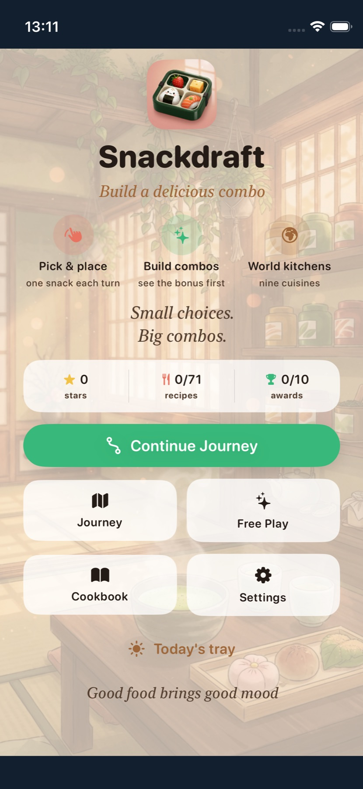
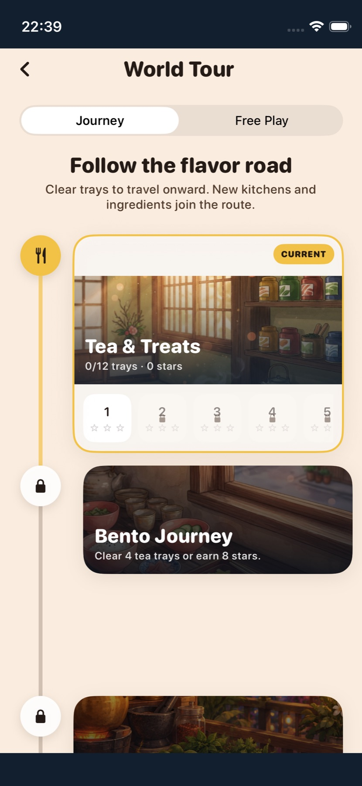

# Snackdraft

**Pick one bite. Build a delicious little world.** Snackdraft is a cozy SwiftUI puzzle game for iPhone and iPad. Choose one of three ingredients each turn and place it on a 4×4 tasting tray. Side-connected ingredients make dishes; clever placement also earns combo points.

   [](LICENSE)

| Home | Build a tray | Learn the recipe shape |
| :---: | :---: | :---: |
|  |  |  |

The current game has **33 ingredients, 71 recipes, 70 levels, 9 kitchens, and 10 achievements**. Journey mode gradually unlocks new kitchens and pantry items; Free Play lets you cook with everything unlocked in a kitchen without changing campaign stars. There is also a daily tray, sound cues, ambient kitchen music, and optional haptics.

## How to play

1. Pick **one of three** offered ingredients, then tap or drag it into an empty cell. A fresh offer appears after each placement.
2. Join a recipe's ingredients **side-to-side**. The group can bend into an L or another shape; diagonal-only contact does not count. A different ingredient cannot bridge a recipe.
3. One tray can make **several recipes**, even when they share ingredients. The live hint shows how many pieces of the suggested recipe are actually connected.
4. **Serve as soon as one recipe is ready**, or continue for more recipes and points. Filling all 16 cells is optional and adds a +500 Full Tray bonus.

The separate **Sweet Line** combo is the exception: strawberry, cookie, and pancake must share one row or column. The first play opens an animated, replayable guide; the **?** button on the play screen opens it again.

[Full illustrated playing guide](docs/PLAY_GUIDE.md)

## Kitchens and modes

Tea & Treats → Bento Journey → Thai Night Market → Israeli Table → Italian Trattoria → Sweet Garden → Cozy Kitchen → Mexican Mercado → Indian Spice House.

- **Journey:** clear levels and earn stars to unlock kitchens and new ingredients.
- **Free Play:** choose an unlocked kitchen and use its full pantry; campaign stars stay unchanged.
- **Daily tray:** a date-seeded challenge using an unlocked kitchen.
- **Cookbook:** browse all recipes, the pantry, and achievements; filter recipes by kitchen or by those already made.

| World Tour | Cookbook | Two recipes on one tray |
| :---: | :---: | :---: |
|  |  |  |

Screenshots are from the iPhone 13 mini simulator; the result uses a deterministic UI-test tray. No personal device screenshot is included.

## Build and test

Open the checked-in `Snackdraft.xcodeproj` in Xcode and run the **Snackdraft** scheme on an iOS 18+ simulator. XcodeGen is only needed if you change `project.yml`:

```bash
brew install xcodegen
sh scripts/generate-project.sh
```

Run the unit and UI tests with an available simulator ID (`xcrun simctl list devices available`):

```bash
xcodebuild test -project Snackdraft.xcodeproj -scheme Snackdraft \
  -destination 'platform=iOS Simulator,id=<SIMULATOR_UDID>' \
  CODE_SIGNING_ALLOWED=NO
```

For a physical iPhone, select your own Apple Developer Team and bundle ID in Xcode. The optional install helper requires your team ID and paired device UDID:

```bash
SNACKDRAFT_TEAM_ID=YOUR_TEAM_ID sh scripts/install-device.sh YOUR_DEVICE_UDID
```

## Project layout

```text
Snackdraft/
  App/             navigation, progress, play sessions
  Audio/           synthesized cues and kitchen ambience
  Game/Engine/     board, draft, recipes, scoring, level catalog
  Game/Food/       ingredient art and tray rendering
  Features/        home, play, result, worlds, cookbook, settings
  Persistence/     on-device saves
  Resources/       image assets and privacy manifest
SnackdraftTests/   game-rule tests
SnackdraftUITests/ screen and interaction tests
docs/              guides and simulator screenshots
```

Snackdraft has no account, advertising, analytics, or backend. Progress stays on the device. See [Privacy](PRIVACY.md) and the [MIT license](LICENSE).
