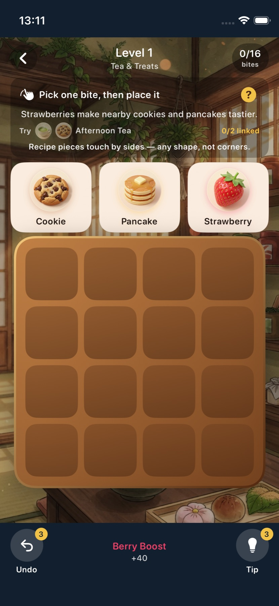
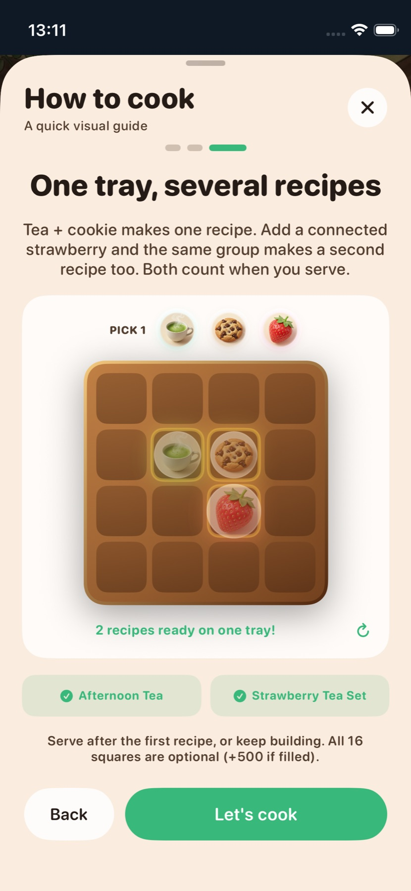
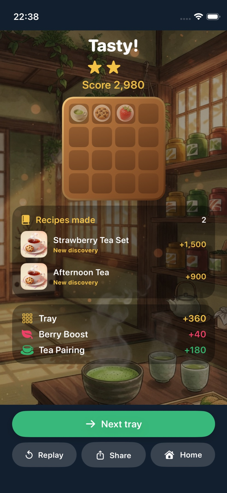
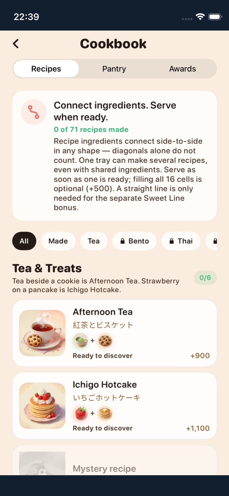

# Playing Snackdraft

[Back to README](../README.md)

## 1. Pick one ingredient

Three choices appear above the tray. Tap one and then an empty cell, or drag it directly onto the tray. You place **one** ingredient per turn; the three choices refresh after that placement.

## 2. Make a connected recipe

The required ingredients must form **one connected group through their own cells**. They touch on the top, bottom, left, or right. A corner touch does not count, and an unrelated ingredient cannot serve as a bridge. A recipe can make an L or any other connected shape; a straight line is **not** required.

In the animated example, tea sits beside a cookie. Strawberry then goes **below the cookie**, making an L. That same group completes both **Afternoon Tea** and **Strawberry Tea Set**.

The small `0/2 linked` indicator on the play screen counts ingredients in the **largest connected group** for the suggested recipe—not loose ingredients elsewhere on the board. Once a recipe is complete, the Serve button appears. It shows the total bonus of every completed recipe on this tray. Each named recipe is counted once per tray, and recipes can share ingredients.

## 3. Serve early or keep building

You may serve as soon as one recipe is ready. You do **not** have to fill all 16 cells. Keep building if you want to complete more recipes or earn more points; a full tray adds **+500**. If you fill the tray, the round scores automatically.

Recipe bonuses and **combo bonuses** are different. A number previewed on an empty cell is the immediate combo gain for placing the currently selected ingredient there; recipe bonuses are added when the tray is served. Ordinary neighbor combos need side contact. The separate **Sweet Line** combo specifically asks for strawberry, cookie, and pancake in the same row or column. They do not need to be consecutive.

## Modes, tips, and collection

- **Journey** opens kitchens and pantry items gradually as you clear levels and earn stars.
- **Free Play** uses the full pantry of an unlocked kitchen and does not change journey stars.
- **Daily tray** is a date-seeded challenge.
- **Undo** takes back the last placement while uses remain. **Tip** highlights a strong current placement; it optimizes immediate score and may not be the missing piece of your suggested recipe.
- The **Cookbook** shows recipes, ingredients, and achievements. Choose **Made** to see recipes you have already served.
- The first play opens this explanation as a short animation. Tap **?** on the play screen to watch it again; the circular arrow in the guide replays its example.

